# Developer Guide

## Acknowledgements

{list here sources of all reused/adapted ideas, code, documentation, and third-party libraries -- include links to the original source as well}

## Design & implementation

### Implementation: Kai Jie

### Overall architecture

---

### App

The `App` is responsible for continuously running the program until a flag to stop is received from a `CommandResult`. It coordinates all major components — `Parser`, `Ui`, `StudentDatabase`, `Storage`, and `CommandHistory` — within its main loop.

#### Class Diagram

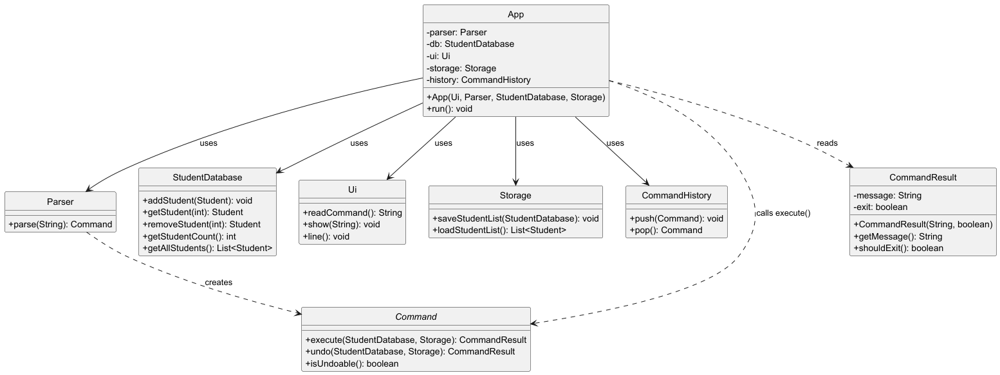

The class diagram shows the relationship between `App` and other components:
- `App` depends on `Parser` to parse user input into `Command` objects.
- `App` calls `Command.execute(db, storage)` and receives a `CommandResult`.
- `App` uses `Ui` to read input and display output.
- `App` uses `CommandHistory` to track undoable commands.
- `App` terminates the loop when `CommandResult.shouldExit()` returns true.

---

### Command

The `Command` interface defines the contract that all command classes must implement. It supports both simple execution and storage-aware execution, as well as undo operations.

#### Class Diagram

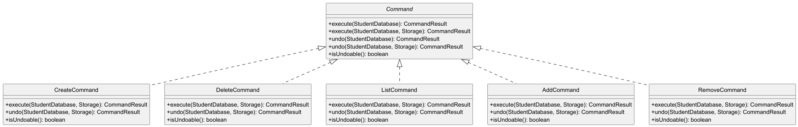

The class diagram shows the relationship between `Command` and other components:
- `Command` is implemented by `CreateCommand`, `DeleteCommand`, `ListCommand`, `AddCommand`, and `RemoveCommand`.
- Each implementation provides `execute(StudentDatabase, Storage)` for the primary action and `undo(StudentDatabase, Storage)` to reverse it.
- `isUndoable()` signals to `App` whether the command should be pushed onto `CommandHistory`.

---

### CommandResult

The `CommandResult` encapsulates the outcome of a command execution, carrying the message to display to the user and an optional exit flag to signal program termination.

#### Class Diagram

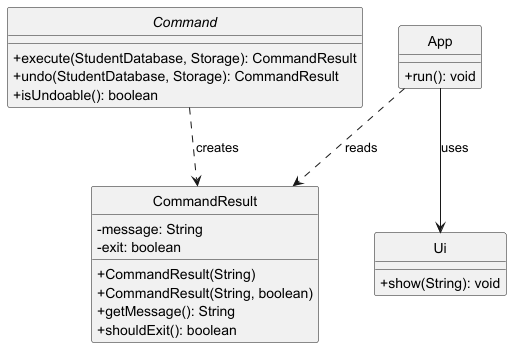

The class diagram shows the relationship between `CommandResult` and other components:
- Every `Command.execute()` call returns a `CommandResult`.
- `App` reads the message via `getMessage()` and passes it to `Ui.show()`.
- `App` checks the exit flag via `shouldExit()` to determine whether to terminate the main loop.
- 
---

### CommandException

The `CommandException` is an unchecked exception thrown when a command fails to execute due to an invalid state or an operation that cannot be completed, such as an out-of-bounds index or an undo on a non-executed command.

#### Class Diagram

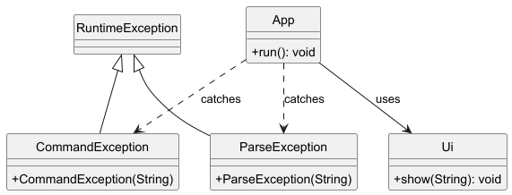

The class diagram shows the relationship between `CommandException` and other components:
- `CommandException` extends `RuntimeException`.
- It is thrown by `Command.execute()` and `Command.undo()` implementations when execution cannot proceed.
- `App` catches `CommandException` in its main loop and passes the error message to `Ui.show()`.

---

### ParseException

The `ParseException` is an unchecked exception thrown when the `Parser` or `ArgumentTokenizer` receives input that does not conform to the expected format, such as an unknown command keyword, a malformed argument string, or a duplicate prefix.

#### Class Diagram

The class diagram shows the relationship between `ParseException` and other components:
- `ParseException` extends `RuntimeException`.
- It is thrown by `Parser` and `ArgumentTokenizer` when input cannot be parsed.
- `App` catches `ParseException` in its main loop and passes the error message to `Ui.show()`.

---

### Config

The `Config` class holds all application-wide command keyword constants as public static final strings. It is a utility class with a private constructor to prevent instantiation, and is referenced by `Parser` when matching user input to command types.

#### Class Diagram

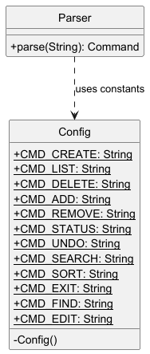

The class diagram shows the relationship between `Config` and other components:
- `Config` is a `final` class with only static String constants and a private constructor.
- `Parser` references `Config` constants (e.g., `Config.CMD_CREATE`, `Config.CMD_DELETE`) in its switch expression to route input to the correct parse method.

---

### Parser

The `Parser` is responsible for interpreting raw user input into executable `Command` objects. It splits input into a command keyword and arguments, delegates argument tokenisation to `ArgumentTokenizer`, validates field values, and constructs the appropriate `Command`.

#### Class Diagram

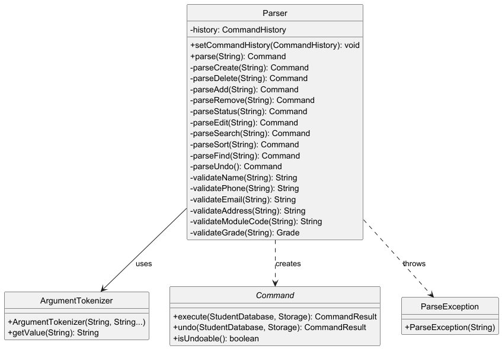

The class diagram shows the relationship between `Parser` and other components:
- `Parser` uses `ArgumentTokenizer` to tokenise argument strings into key-value maps.
- `Parser` creates and returns concrete `Command` objects via its private `parseX()` methods.
- `Parser` holds a reference to `CommandHistory`, injected by `App`, which is passed to `UndoCommand`.
- `Parser` throws `ParseException` when input is malformed or a field fails validation.

---

### ArgumentTokenizer

The `ArgumentTokenizer` parses a raw argument string into a map of prefix-to-value pairs. It scans the string for recognised prefixes (e.g., `n/`, `p/`, `e/`) and extracts the substring between each prefix and the next, respecting a whitespace-before-prefix rule to avoid false matches within values.

#### Class Diagram

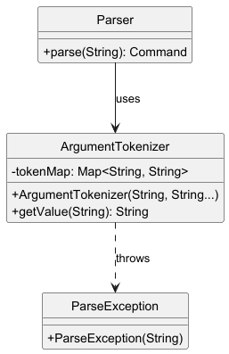

The class diagram shows the relationship between `ArgumentTokenizer` and other components:
- `ArgumentTokenizer` is constructed by `Parser` with the argument string and a varargs list of expected prefixes.
- It populates an internal `Map<String, String>` of prefix to value during construction.
- `Parser` retrieves individual values via `getValue(prefix)`.
- `ArgumentTokenizer` throws `ParseException` if a duplicate prefix is detected.

---

### Student and StudentDatabase

The `Student` class represents a student record holding personal details and a list of `Module` objects. `StudentDatabase` manages the in-memory collection of all students, providing methods to add, retrieve, update, and remove them. `Student` instances are constructed using the `Student.Builder` pattern, which enforces that `name` is always provided.

#### Class Diagram

The class diagram shows the relationship between `Student`, `StudentDatabase`, and other components:
- `StudentDatabase` contains a `List<Student>` and exposes CRUD methods.
- `Student` holds personal fields and a `List<Module>`, and provides computed methods such as `calculateCap()`, `getTotalMCs()`, and `getProgressStatus()`.
- `Student` is built via the inner `Student.Builder` class, which allows optional fields to be set via a fluent API.
- `Command` subclasses interact with `StudentDatabase` to perform operations on student records.

---

### Grade

The `Grade` enum represents all possible grade values a `Module` can carry, including letter grades, pass/fail designations, and special statuses such as `IN_PROGRESS`, `AUDIT`, and `EXEMPTED`. Each constant carries a grade point value, a flag indicating whether it counts towards GPA, and a flag indicating whether it counts towards module completion.

#### Class Diagram

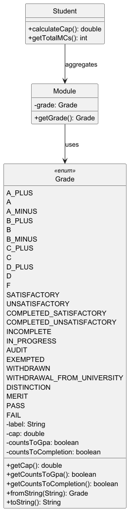

The class diagram shows the relationship between `Grade` and other components:
- `Grade` is held by `Module`, which passes its grade to `Student` methods such as `calculateCap()` and `getTotalMCs()`.
- `Grade.fromString(String)` is used by `Parser` to convert a user-supplied grade string into the corresponding enum constant, throwing `IllegalArgumentException` (wrapped by `Parser` as `ParseException`) if the input is unrecognised.

---

### Module

The `Module` class represents a course module associated with a `Student`. Each `Module` holds a module code, a `Grade`, and a credit count (defaulting to 4 MCs if not specified). It is created by `AddCommand` and stored in the student's module list.

#### Class Diagram

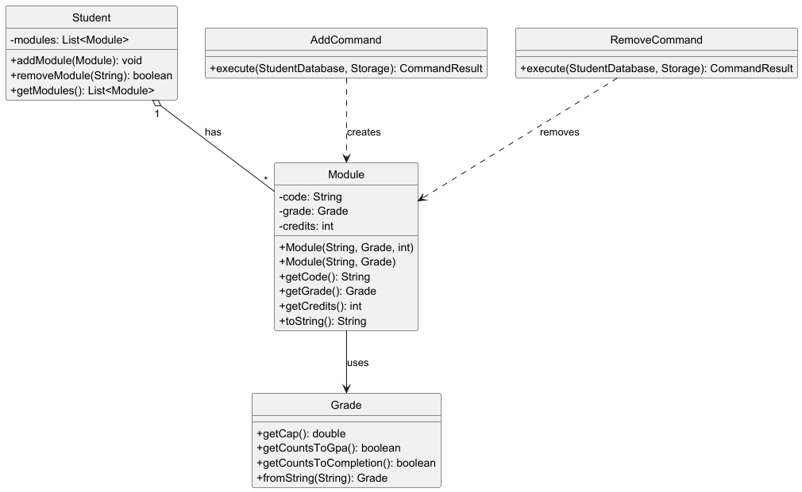

The class diagram shows the relationship between `Module` and other components:
- `Module` is created by `AddCommand` and held in a `Student`'s `List<Module>`.
- `Module` references `Grade` for its grade value.
- `RemoveCommand` searches the student's module list by code and removes the matching `Module`.
- `Student.calculateCap()` and `Student.getTotalMCs()` iterate over the module list, calling `getGrade()`, `getCredits()`, and the grade's computed properties.

---

### Ui

The `Ui` class handles all console input and output. It reads user commands from standard input via a `Scanner` and displays messages surrounded by separator lines. Output methods are static to allow calls from anywhere without needing a `Ui` instance.

#### Class Diagram

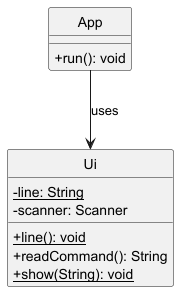

The class diagram shows the relationship between `Ui` and other components:
- `Ui` is instantiated once by `Main` and passed to `App`.
- `App` calls `ui.readCommand()` each loop iteration to obtain input.
- `App` calls the static `Ui.show(String)` to display command results and error messages.
- `Ui.line()` prints a horizontal separator, called internally by `show()`.

---

### Main

The `Main` class is the entry point of the application. It initialises all top-level components, loads persisted student data from `Storage`, and starts `App`.

#### Class Diagram

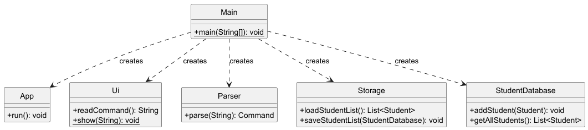

The class diagram shows the relationship between `Main` and other components:
- `Main` creates `Ui`, `Parser`, and `Storage` instances.
- `Main` attempts to load the student list from `Storage`; on `IOException`, it logs the error via `Ui.show()` and initialises an empty `StudentDatabase`.
- `Main` constructs `App` with all dependencies and calls `App.run()`.

---

### Create Command

The `CreateCommand` allows users to create a new student record with a required name and optional phone, email, address, and course fields. It supports undo by storing the index of the created student and removing it on `undo()`.

#### Class Diagram

The class diagram shows the relationship between `CreateCommand` and other components:
- `CreateCommand` implements the `Command` interface.
- It uses `Student.Builder` to construct a `Student` and `StudentDatabase.addStudent()` to persist it.
- It calls `Storage.saveStudentList()` to write changes to disk.
- It returns a `CommandResult` containing a confirmation message with the student's name.

#### Sequence Diagram

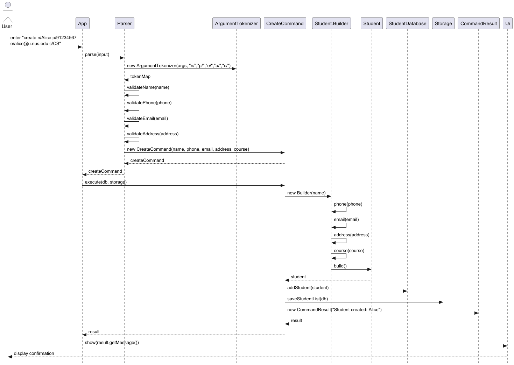

The sequence diagram illustrates the execution flow:
1. User inputs the create command with arguments (e.g., `create n/Alice p/91234567 e/alice@u.nus.edu c/CS`).
2. `Parser.parse()` identifies the `create` keyword and delegates to `Parser.parseCreate()`.
3. `Parser.parseCreate()` constructs an `ArgumentTokenizer` with prefixes `n/`, `p/`, `e/`, `a/`, `c/` and calls `validateName()`, `validatePhone()`, `validateEmail()`, `validateAddress()`.
4. A `CreateCommand` is constructed with the validated fields.
5. `App` calls `CreateCommand.execute(db, storage)`.
6. `CreateCommand` builds a `Student` via `Student.Builder`, calls `db.addStudent(student)`, then `storage.saveStudentList(db)`.
7. A `CommandResult` is returned with the message `"Student created: <name>"`.

---

### Delete Command

The `DeleteCommand` allows users to remove an existing student record by 1-based index. It supports undo by storing the deleted `Student` and its original index for reinsertion.

#### Class Diagram

The class diagram shows the relationship between `DeleteCommand` and other components:
- `DeleteCommand` implements the `Command` interface.
- It calls `StudentDatabase.removeStudent(index)` and stores the returned `Student` for potential undo.
- It calls `Storage.saveStudentList()` to persist the change.
- It throws `CommandException` if the index is out of bounds.
- It returns a `CommandResult` containing the deleted student's details.

#### Sequence Diagram

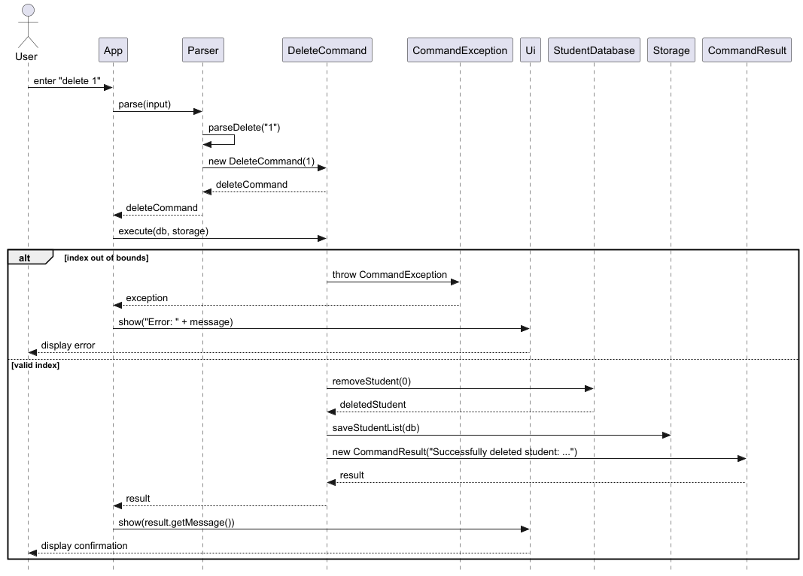

The sequence diagram illustrates the execution flow:
1. User inputs the delete command (e.g., `delete 1`).
2. `Parser.parse()` identifies the `delete` keyword and calls `Parser.parseDelete()`, which parses the integer index.
3. A `DeleteCommand` is constructed with the index.
4. `App` calls `DeleteCommand.execute(db, storage)`.
5. If the index is out of bounds, `CommandException` is thrown and `App` displays the error.
6. Otherwise, `db.removeStudent(index - 1)` is called, the returned `Student` is stored, `storage.saveStudentList(db)` is called, and a `CommandResult` with the student's details is returned.

---

### List Command

The `ListCommand` retrieves and displays all student records currently held in `StudentDatabase`. It is not undoable as it performs no mutations.

#### Class Diagram

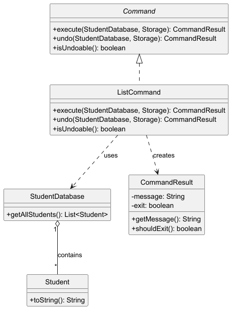

The class diagram shows the relationship between `ListCommand` and other components:
- `ListCommand` implements the `Command` interface.
- It calls `StudentDatabase.getAllStudents()` to retrieve the full student list.
- It formats each student using `Student.toString()` with a 1-based index prefix.
- It returns a `CommandResult` with the formatted list, or a "No students found." message if the list is empty.
- `isUndoable()` returns `false`; `undo()` throws `CommandException`.

#### Sequence Diagram

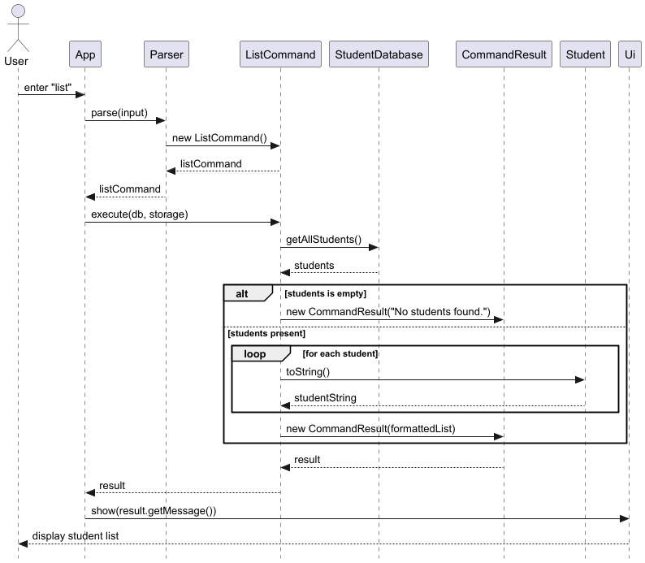

The sequence diagram illustrates the execution flow:
1. User inputs `list`.
2. `Parser.parse()` matches the `list` keyword and returns `new ListCommand()` directly (no argument parsing required).
3. `App` calls `ListCommand.execute(db, storage)`.
4. `ListCommand` calls `db.getAllStudents()` and checks if the list is empty.
5. If empty, a `CommandResult("No students found.")` is returned.
6. Otherwise, `ListCommand` iterates over all students, calls `student.toString()`, and builds a numbered output string.
7. A `CommandResult` containing the formatted list is returned and displayed via `Ui`.

---

### Add Command

The `AddCommand` adds a `Module` to an existing student's module list, identified by 1-based index. The module is specified as `CODE/GRADE` or `CODE/GRADE/CREDITS`. It supports undo by removing the added module.

#### Class Diagram

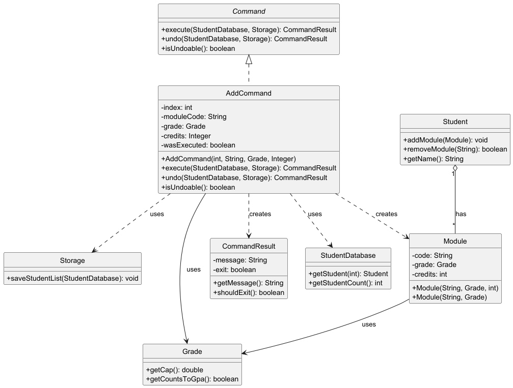

The class diagram shows the relationship between `AddCommand` and other components:
- `AddCommand` implements the `Command` interface, residing in the `dextro.command.module` subpackage.
- It retrieves the target `Student` from `StudentDatabase` by index.
- It constructs a `Module` with the given code, `Grade`, and optional credit count.
- It calls `student.addModule(module)` and `storage.saveStudentList(db)`.
- `undo()` calls `student.removeModule(moduleCode)` to reverse the addition.

#### Sequence Diagram

The sequence diagram illustrates the execution flow:
1. User inputs the add command (e.g., `add 1 CS2113/A`).
2. `Parser.parse()` identifies the `add` keyword and calls `Parser.parseAdd()`.
3. `Parser.parseAdd()` splits the index from the module string, validates the module code via `validateModuleCode()` and the grade via `validateGrade()` (which calls `Grade.fromString()`).
4. An `AddCommand` is constructed with the index, module code, `Grade`, and optional credits.
5. `App` calls `AddCommand.execute(db, storage)`.
6. If the index is invalid, a `CommandResult("Invalid student index")` is returned immediately.
7. Otherwise, the student is retrieved, a `Module` is constructed, `student.addModule(module)` is called, `storage.saveStudentList(db)` is called, and a `CommandResult` confirming the addition is returned.

---

### Remove Command

The `RemoveCommand` removes a named `Module` from an existing student's module list, identified by 1-based index. It supports undo by storing the removed `Module` reference for reinsertion.

#### Class Diagram

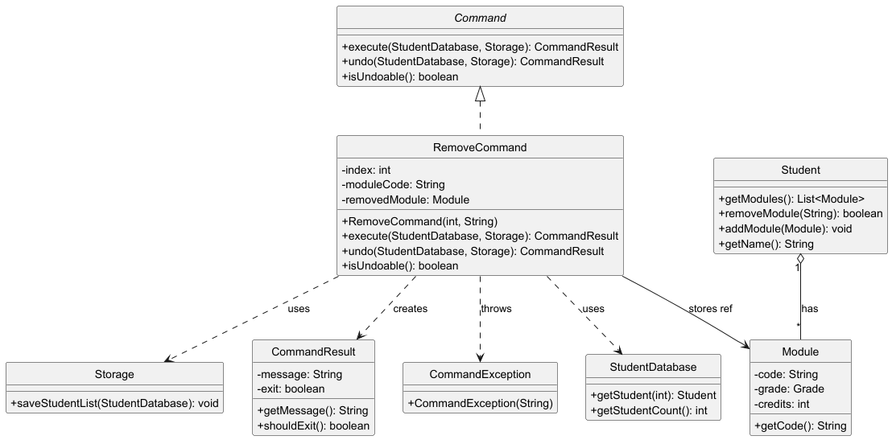

The class diagram shows the relationship between `RemoveCommand` and other components:
- `RemoveCommand` implements the `Command` interface, residing in the `dextro.command.module` subpackage.
- It retrieves the target `Student` from `StudentDatabase` by index.
- It iterates over `student.getModules()` to locate and store a reference to the module before removal (for undo support).
- It calls `student.removeModule(moduleCode)` and `storage.saveStudentList(db)`.
- `undo()` calls `student.addModule(removedModule)` to reinsert the saved module.
- `CommandException` is thrown by `undo()` if the command was never executed or the module was not found.

#### Sequence Diagram

The sequence diagram illustrates the execution flow:
1. User inputs the remove command (e.g., `remove 1 CS2113`).
2. `Parser.parse()` identifies the `remove` keyword and calls `Parser.parseRemove()`, which splits the index and module code.
3. A `RemoveCommand` is constructed with the index and module code (uppercased).
4. `App` calls `RemoveCommand.execute(db, storage)`.
5. If the index is invalid, a `CommandResult("Invalid student index")` is returned immediately.
6. Otherwise, the student is retrieved and `student.getModules()` is iterated to find and store the matching `Module`.
7. `student.removeModule(moduleCode)` is called; if successful, `storage.saveStudentList(db)` is called and a confirmation `CommandResult` is returned.
8. If the module code is not found, a `CommandResult` indicating the module was not found is returned.

---

### Implementation: Matthias

#### Status Command

The `StatusCommand` allows users to view detailed information about a specific student, including their CAP, total MCs completed, and progress status.

##### Class Diagram

The class diagram shows the relationship between `StatusCommand` and other components:
- `StatusCommand` implements the `Command` interface
- It uses with `StudentDatabase` to retrieve student information, and Storage to save the changes.
- Returns a `CommandResult` containing the status information

##### Sequence Diagram

The sequence diagram illustrates the execution flow:
1. User executes the status command with a student index
2. `StatusCommand.execute()` is called with the `StudentDatabase` and `Storage`
3. The command validates the index and retrieves the student
4. Student information (CAP, MCs, status) is calculated and formatted
5. A `CommandResult` is returned with the formatted status message

#### Undo Command

The `UndoCommand` allows users to revert the last undoable command that modified the student database.

##### Class Diagram

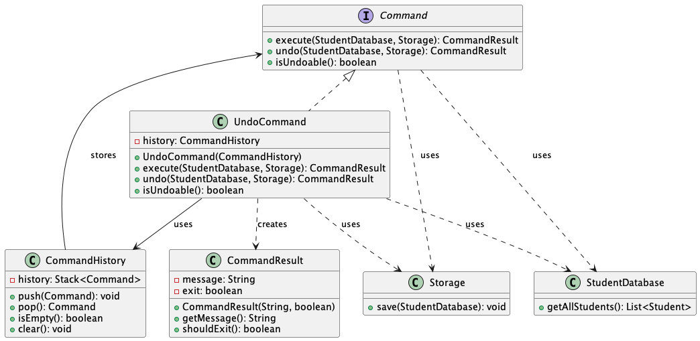

The class diagram shows the relationship between `UndoCommand` and other components:
- `UndoCommand` implements the `Command` interface
- It maintains a reference to `CommandHistory` which tracks executed commands
- It interacts with `StudentDatabase` and `Storage` to perform the undo operation
- Returns a `CommandResult` indicating the undo operation result

##### Sequence Diagram

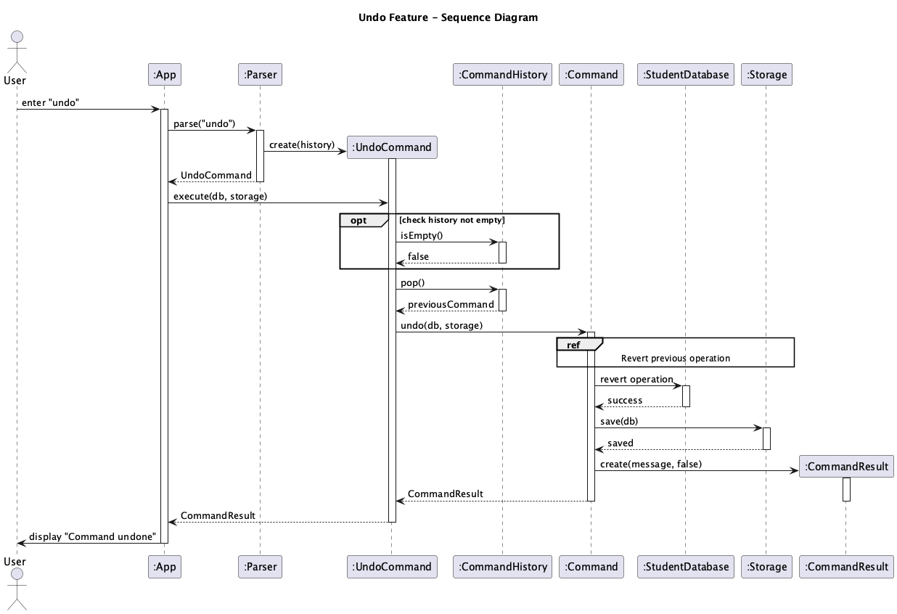

The sequence diagram illustrates the execution flow:
1. User executes the undo command
2. `UndoCommand.execute()` is called with the `StudentDatabase` and `Storage`
3. The command checks if there are any commands to undo in the `CommandHistory`
4. If available, the last command is popped from the history
5. The `undo()` method of the last command is invoked
6. A `CommandResult` is returned indicating the success or failure of the undo operation

---

### Implementation: Wen Yuan

#### Edit Command

The `EditCommand` allows users to alter attributes of the student records.

##### Class Diagram

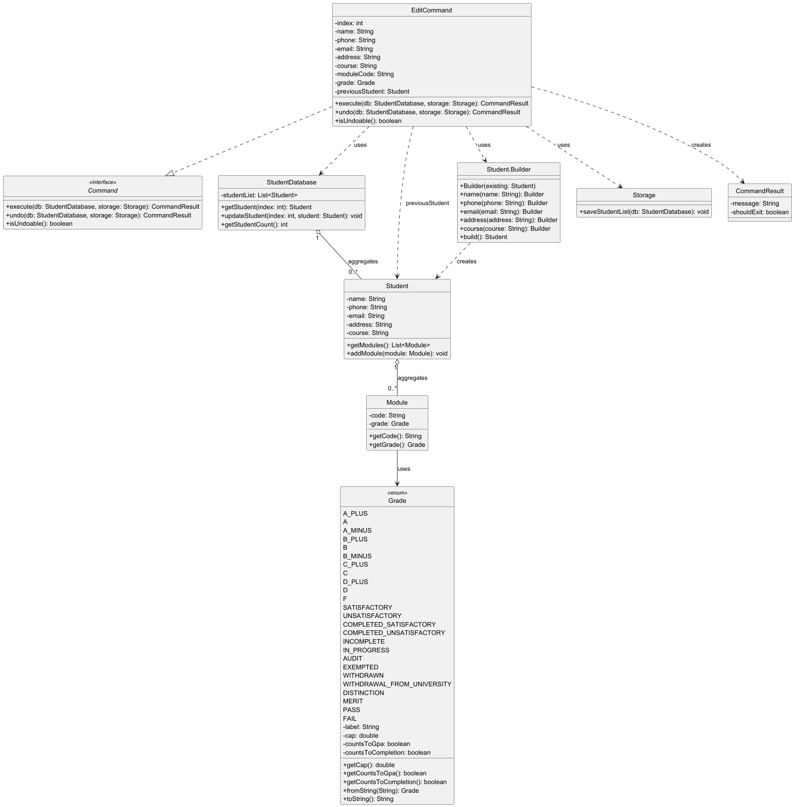

The class diagram shows the relationship between `EditCommand` and other components:
- `EditCommand` implements the `Command` interface
- `EditCommand` needs references from Storage and Student class, and has an aggregation relationship with StudentDatabase. 
- It interacts with `StudentDatabase` to retrieve/manipulate student information
- It uses the `Storage` component for persistence operations
- Returns a `CommandResult` containing the status information
- All methods listed in `Command` is implemented in `EditCommand` class as there is no further child class from `EditCommand`.

##### Sequence Diagram

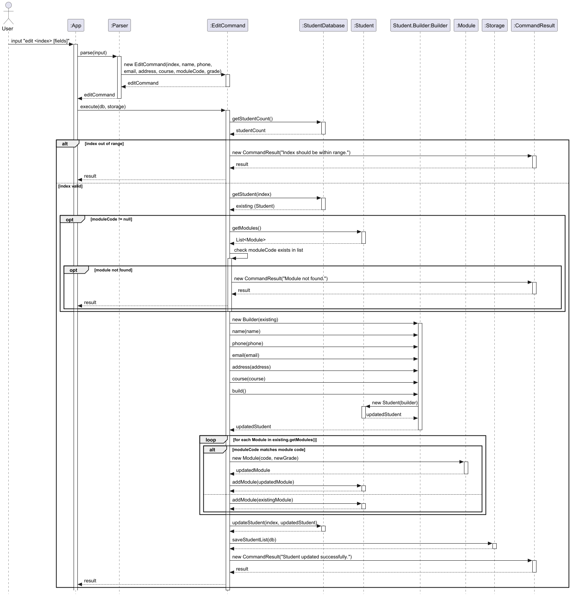

The sequence diagram illustrates the execution flow:
1. User executes the edit command with attribute flags(e.g n/ for name and a/ for address)
2. `Parser` class parse user input and determine which eactly which record is of concern and which attribute needs to be edited based on the flags
3. `EditCommand` class constructs an object with all attributes attach to it.
4. The exact `Student` object is extracted out of `StudentDatabase`
5. The `Student` object is then rebuilt with updated attributes.
6. If module need to updated, `EditCommand` will search through the list of modules in `Student`. If Module does not exists, it will add the module in the `Student`.
7. `saveStudentList()` is called to save all updates in the database.

#### Find Command

The `FindCommand` allows users to find user-defined keyword and pinpoint to student record containing that keyword. More than one record can be queried if there is a common keyword.

##### Class Diagram

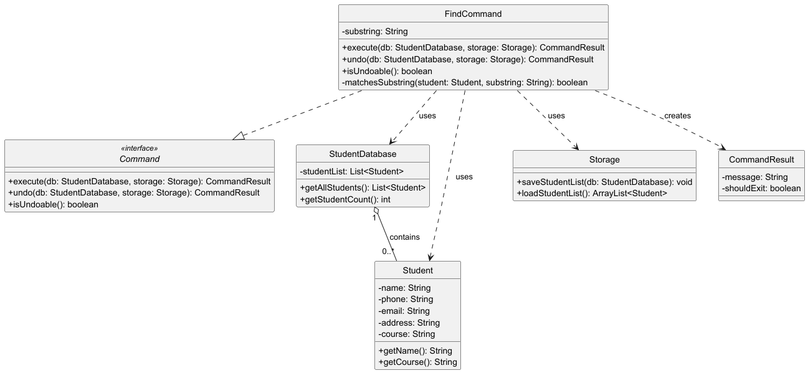

The class diagram shows the relationship between `FindCommand` and other components:
- Similar to `EditCommand`, `FindCommand` also implements the `Command` interface
- `FindCommand` needs to reference of `Storage` and `StudentDatabase`. 
- `FindCommand` compose of `CommandException`. 
- It interacts with `StudentDatabase` to retrieve relevant student records.
- Although `Storage` is not used in execute method under `FindCommand`, the `Command` require it to be there. So the method signature must match `Command`.
- All methods listed in `Command` is implemented in `FindCommand` class as there is no further child class from `FindCommand`.

##### Sequence Diagram

The sequence diagram illustrates the execution flow:
1. User executes the find command with string that he/she wants to find.
2. `Parser` class parse user input and determine the command(find) and the keyword(string).
3. `FindCommand` then retrieve all student information from `StudentDatabase` .
4. A loop will check if any of the student information correspond to the keyword defined by the user.
5. The `CommandResult` will display if the student records are found.

## Product scope
### Target user profile

The target user is an Administrative Staff member (Admin) at the National University of Singapore (NUS). These users are:
- Responsible for managing large cohorts of students and their academic progression
- Comfortable using Command Line Interfaces (CLI) for fast data entry and retrieval
- In need of a centralized, local system to manage student contact details and module grades without the overhead of a heavy web-based GUI.

### Value proposition

Student Records information may be stored in a fragemented fashion, with academic history in one system and progress tracking (GPA, Module Code) in another. The Student Record Data Management System (SRDMS) provides a streamlined, keyboard-centric workflow for maintaining student databases. By using a CLI-based approach, it enables admins to perform batch-like updates and quick searches significantly faster than traditional spreadsheet or form-based systems.

## User Stories

| Version | As a ... | I want to ...                            | So that I can ...                                                       |
|---------|----------|------------------------------------------|-------------------------------------------------------------------------|
| v1.0    | Admin    | create a new student record              | add new enrollees to the system record system.                               |
| v1.0    | Admin    | list all students                        | see a high-level overview of the current student population.            |
| v1.0    | Admin    | delete a student entry                   | remove records of students who have withdrawn or graduated.             |
| v2.0    | Admin    | edit student details (name, email, etc.) | ensure the database remains accurate as student information changes.    |
| v2.0    | Admin    | add or remove modules for a student      | track their academic history and specific module completions.           |
| v2.0    | Admin    | check the status of a student            | quickly see a student's CAP, total MCs, and overall academic standing.  |
| v2.0    | Admin    | search students by course or module      | filter the database to find specific groups for administrative actions. |

## Non-Functional Requirements

{Give non-functional requirements}

## Glossary

* *glossary item* - Definition

## Instructions for manual testing

{Give instructions on how to do a manual product testing e.g., how to load sample data to be used for testing}
